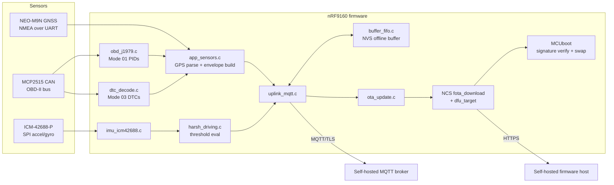

# Architecture & Project Overview

**Start here.** This is the single source of truth for what this project
is, what it's trying to achieve, what's actually been built, and where to
look for more detail. If you're an AI agent picking this project up cold
— read this document fully before opening any source file. It exists so
you don't have to skim the whole codebase to get oriented; only dive into
a specific `src/*.c` file when this document points you there for a
detail it deliberately doesn't repeat, or when you're actually about to
change that file.

> **This is a living document.** If you are an agent (or human) who just
> finished a unit of work on this project — a bug fix, a new feature, a
> verification pass, anything that changes what's true about the system
> — you must update this document before you consider the work done.
> See "Keeping this document current" at the bottom for exactly what that
> means. An out-of-date architecture doc is worse than no architecture
> doc, because the next reader will trust it.

_Last updated: 2026-08-11, end of the post-Phase-6 workspace hygiene pass._

## What this is

A self-hosted, DIY vehicle tracker forked from Golioth's open-source
`reference-design-can-asset-tracker` (Apache-2.0), retargeted at
functional parity with commercial trackers like the Jimi IoT JM-VL04:
live GPS location, live OBD-II PIDs, stored DTC (check-engine) codes,
IMU-based harsh-driving detection, offline buffering, and MQTT/TLS
upload — all to infrastructure you run yourself, not a vendor cloud.
Target hardware: Nordic nRF9160-DK + u-blox NEO-M9N GNSS +
MCP2515/SN65HVD230 CAN + ICM-42688-P IMU. See `README.md` for the full
hardware list and attribution details.

## Goal checklist (JM-VL04 functional parity)

| Capability | Status |
|---|---|
| Live GPS location | Built (NMEA RMC+GGA via `app_sensors.c`) |
| Live OBD-II PIDs (speed/RPM/fuel/coolant/voltage) | Built (`obd_j1979.c`) |
| Stored DTC (check-engine) codes | Built, single-frame only (`dtc_decode.c`) |
| Harsh-driving detection (accel/brake/corner) | Built, placeholder thresholds (`harsh_driving.c`/`imu_icm42688.c`) |
| Offline buffering across connectivity gaps | Built (`buffer_fifo.c`) |
| MQTT/TLS upload to self-hosted infra | Built (`uplink_mqtt.c`) |
| Remote firmware update | Built (`ota_update.c`) |
| **Real-world verification of any of the above** | **Not done** — see "Current gaps" below |

## Architecture

MQTT and HTTP(S) deliberately do two different jobs: MQTT carries small
telemetry/event/status messages and a tiny OTA *pointer* (new version +
URL); HTTP(S) — driven by `fota_download`, not hand-rolled — carries the
actual (larger) signed firmware binary. See `docs/AUDIT.md`'s Phase 6
section for why this split was chosen.

## Module map

| File | Responsibility | Status |
|---|---|---|
| `src/main.c` | Boot sequence: MCUboot image confirm, sensor/OBD/IMU/OTA init, LTE bring-up, main sensor loop | Stable |
| `src/app_sensors.c`/`.h` | GPS (NMEA RMC+GGA) parsing, telemetry JSON envelope assembly, DTC-event dedup | Stable |
| `src/obd_j1979.c`/`.h` | SAE J1979 Mode 01 PID request/response (speed, RPM, fuel, coolant, control-module voltage) | Stable |
| `src/dtc_decode.c`/`.h` | Mode 03 stored-DTC request/decode. **Read-only by design — no Mode 04 (clear DTCs), no CAN-write/actuation.** Single-frame only. | Stable, scope-limited |
| `src/harsh_driving.c`/`.h` | Pure threshold math (accel/brake/corner). Zero Zephyr dependencies — unit-testable standalone. | Stable, placeholder thresholds |
| `src/imu_icm42688.c`/`.h` | ICM-42688-P SPI polling, feeds `harsh_driving.c` | Stable |
| `src/uplink_mqtt.c`/`.h` | MQTT/TLS uplink: publish telemetry/events/status, subscribe to OTA pointer topic | Stable |
| `src/buffer_fifo.c`/`.h` | NVS-backed offline buffer, separate drop-oldest (telemetry) / reject-on-full (events) channels | Stable |
| `src/ota_update.c`/`.h` + `src/ota_update_certs.h` | OTA pointer parsing → `fota_download` handoff. No custom signing/verification — MCUboot owns that entirely. | Stable |
| `src/app_settings.c`/`.h` | Local runtime config (poll delays, fake-GPS override) | Stable, unchanged from upstream |
| `src/app_rpc.c`/`.h`, `src/app_state.c`/`.h` | No-op stubs left from removed Golioth RPC / LightDB State demo code | Intentionally inert — kept in case a future MQTT command topic re-wires them |

For build-vs-native_sim-vs-hardware verification status **per module**,
see `docs/TESTING.md`'s table — don't duplicate that table here, it will
drift.

## Hard constraints still in effect

These were set at the start of this project and nothing since has
relaxed them. Any future work must keep respecting them:

- **Never `git clone` this repo to set up a workspace** — use `west
  init`/`west update` (manifest-based). See `README.md`'s setup section.
- **No Mode 04 (clear DTCs) or any CAN-write/actuation capability.**
  `dtc_decode.c` is read-only by design, not by omission.
- **MCUboot signature verification must never be weakened, bypassed, or
  given a debug/dev override**, even temporarily. `ota_update.c` does not
  touch signing/verification at all — see `docs/AUDIT.md`'s Phase 6
  section for exactly why that's safe (MCUboot enforces this
  independently of anything the app does).
- **Preserve upstream git history for reused files** — edit in place,
  don't wholesale-rewrite files that originated in the upstream Golioth
  repo. Their original copyright headers must stay intact.
- **Verify Zephyr/NCS API behavior against actually-checked-out source**
  before writing code against it — don't assume API behavior from
  training knowledge. This project has been burned by wrong assumptions
  before (see `docs/AUDIT.md`'s several "confirmed from source, not
  assumed" notes) and caught them precisely by following this rule.

## Current gaps

Full detail lives in `docs/ISSUES.md` (a running list of everything
built without runtime verification) and `docs/TESTING.md` (a
compile/native_sim/hardware verification table, one row per module).
Headline gap, true as of this writing: **nothing in this project has
been run** — not against real or simulated CAN/GPS/IMU traffic, not
against a real MQTT broker, not through a real OTA fetch→reboot→swap
cycle. Everything is compile/link-verified only. Don't let a clean build
imply more than that.

## Documentation map

| Doc | Purpose | Read it when... |
|---|---|---|
| `README.md` | Project intro, hardware, setup/build/flash/test instructions, required-before-deployment config table | You're setting up the project or need the config placeholder list |
| `docs/ARCHITECTURE.md` (this file) | High-level orientation, module map, goals, constraints | Always, first, before touching code |
| `docs/AUDIT.md` | Full phase-by-phase implementation log — every decision, every piece of source read to verify an API claim, every build result | You need the detailed *why* behind something summarized here |
| `docs/ISSUES.md` | Running list of modules built without runtime verification | You're about to trust a module's correctness, or about to verify one |
| `docs/TESTING.md` | Per-module compile/native_sim/hardware verification table, plus the native_sim/vcan0 setup blocker and steps | You're about to run any kind of test |

## Keeping this document current

Whoever (agent or human) finishes a unit of work on this project should,
before calling the work done:

1. **Update the module map** if you added/removed/renamed a file or
   meaningfully changed a module's responsibility or status (e.g. moved
   it from "compile-verified" to "native_sim-verified" — though the
   authoritative version of that specific fact belongs in
   `docs/TESTING.md`; just make sure this file's "Status" column doesn't
   contradict it).
2. **Update the goal checklist** if you completed, started, or changed
   scope on one of the JM-VL04 parity items.
3. **Add a line to "Current gaps"** only if the gap is new and not
   already implied by `docs/ISSUES.md`/`docs/TESTING.md` — don't
   duplicate detail that belongs there.
4. **Update "Hard constraints"** only if the user changes one of the
   actual ground rules — don't add new self-imposed rules here casually.
5. **Bump the "Last updated" line** at the top with the date and a
   one-phrase description of the work, same pattern as today's entry.
6. **Do not let this file, `README.md`, `docs/AUDIT.md`,
   `docs/ISSUES.md`, and `docs/TESTING.md` disagree with each other on
   any factual claim** (a module's verification status, a Kconfig
   default, whether something is implemented). If you find a
   contradiction, resolve it against the actual code/config, then fix
   every doc that had it wrong.
